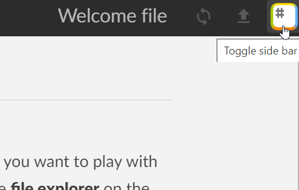
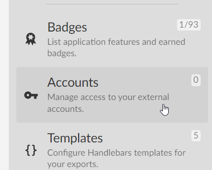
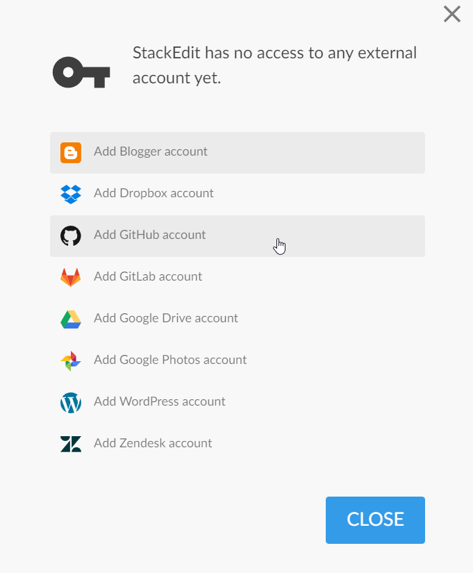
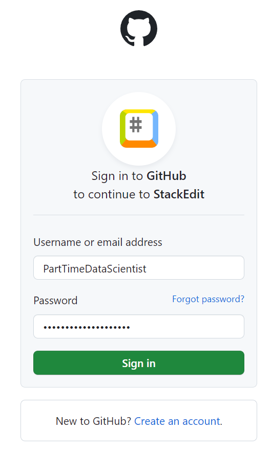
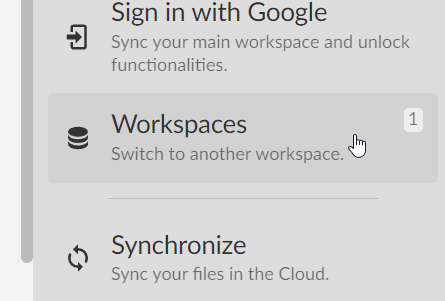
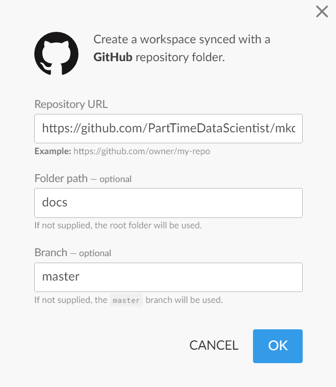
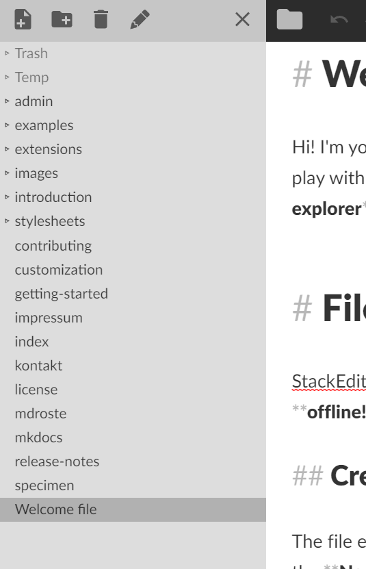
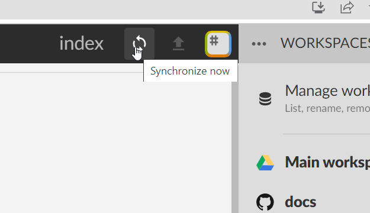

# Einführung

!!! note
    Diese Webseite wird automatisch mittels MkDocs aus einem [GitHub-Repository](https://github.com/PartTimeDataScientist/mkdocs-wiki-test) erzeugt.

****

## Voraussetzungen
Um die Kommentarfunktion benutzen zu können, "Issues" zu erstellen oder Texte ergänzen oder editieren zu können ist ein [Github](https://github.com)-Account notwendig. Dieser ist grundsätzlich erst einmal kostenlos erstellbar und damit lässt sich die Kommentar-Funktion direkt verwenden. Um Änderungen oder Ergänzungen auf den Seiten vornehmen zu können müssen zunächst von [Lars Röglin](mailto:lars.roeglin@strassen.nrw.de) Berechtigungen freigegeben werden.

## Bearbeitung von Inhalten

### "Einfach" mit StackEdit
Eine einfache Möglichkeit, die Seiten zu bearbeiten ist die Verwendung von [StackEdit](https://stackedit.io/app#). Hierzu muss StackEdit zunächst mit dem GitHub-Account verbunden werden.
!!! note 
    Wenn noch kein GitHub-Account vorhanden ist kann dieser bei diesem Schritt auch erstellt werden!

Nach Verknüpfung des Accoungs muss das entsprechende "Repository" noch als "Workspace" eingebunden werden. Dies geschieht ebenfalls über die Sidebar. Hierzu wird ein GitHub workspace mit den folgenden Daten angelegt:

!!! warning "Repository-Daten"
    **Repository URL:** https://github.com/PartTimeDataScientist/mkdocs-wiki-test   
    **Folder path:** docs  
    **Branch:** master 

Wenn der Workspace erfolgreich angelegt wurde können in der linken Sidebar die bestehenden Dokumente eingesehen bzw. auch neue angelegt werden: 

Zum "speichern" bzw. synchronisieren mit GitHub den "Synchronisieren"-Button benutzen. Die Änderungen werden zu GitHub synchronisiert und anschließend wird automatisch eine neue Version der Webseite erzeugt und "hochgeladen".

### Einfügen von Bildern mit StackEdit
Bilder lassen sich bei Verwendung von StackEdit nicht einfach über copy&paste in eine Seite eingefügt werden, sondern müssen hierfür zunächst zu GitHub hochgeladen werden. Dies geht am einfachsten über den "Add file" Button im [enstprechenden Ordner](https://github.com/PartTimeDataScientist/mkdocs-wiki-test/tree/master/docs/images) des Repositories. Nach dem Hochladen der Datei kann diese in StackEdit über die relative URL (in der Regel entweder "images/filename.png" oder "../images/filename.png") eingebunden werden.

### "Advanced" mit Git und beliebigem Editor oder IDE
Anwender mit Git-Kenntnissen können sich nach Freigabe der Berechtigungen das entsprechende [Repository](git@github.com:PartTimeDataScientist/mkdocs-wiki-test.git) einfach klonen und lokal auf ihrem Rechner bearbeiten und Änderungen zurück zu Github pushen.

<!--stackedit_data:
eyJoaXN0b3J5IjpbLTExMzMzNDk0MjMsNzA2NzEwODgzXX0=
-->